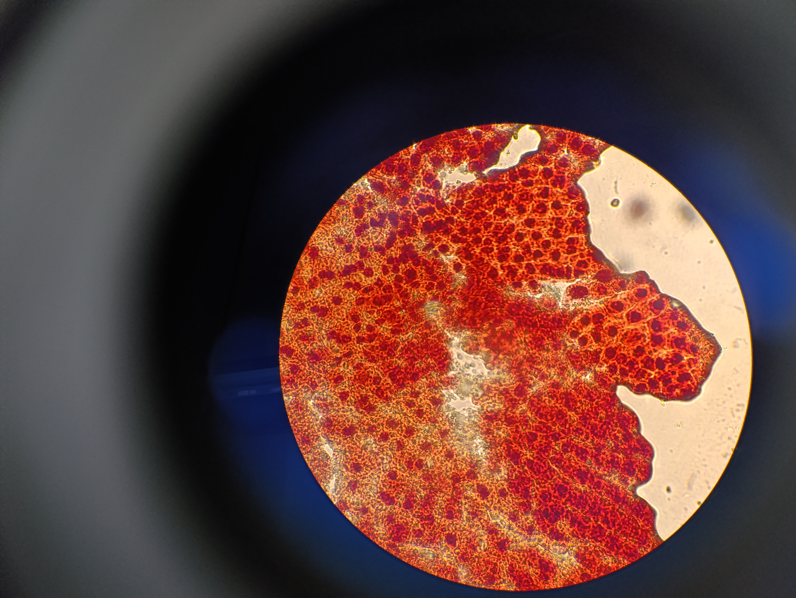
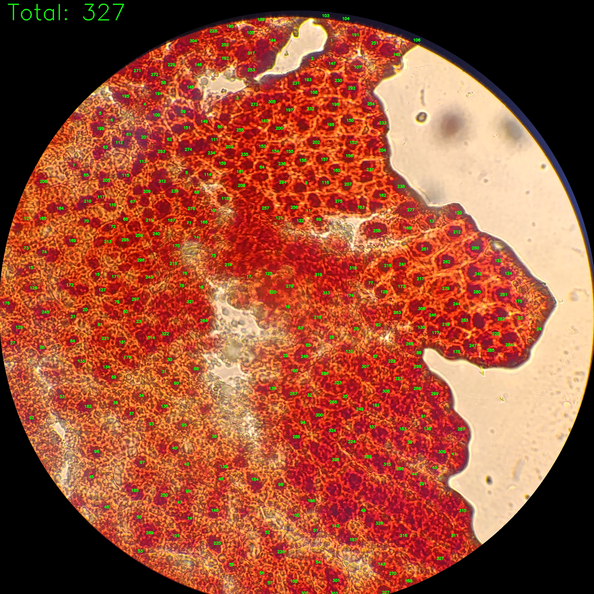
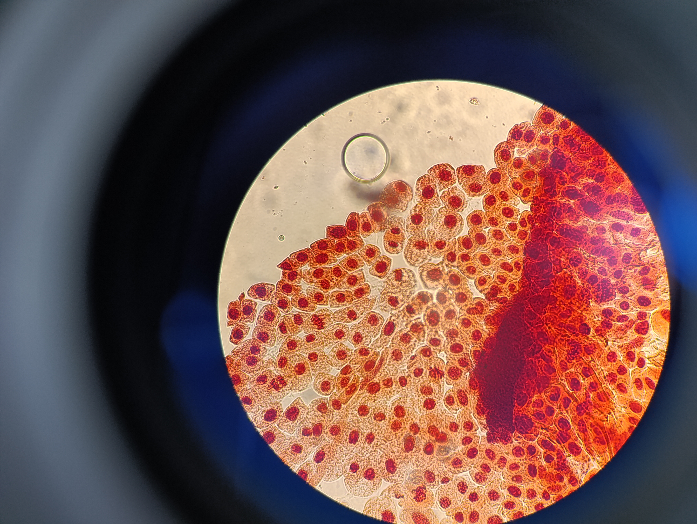
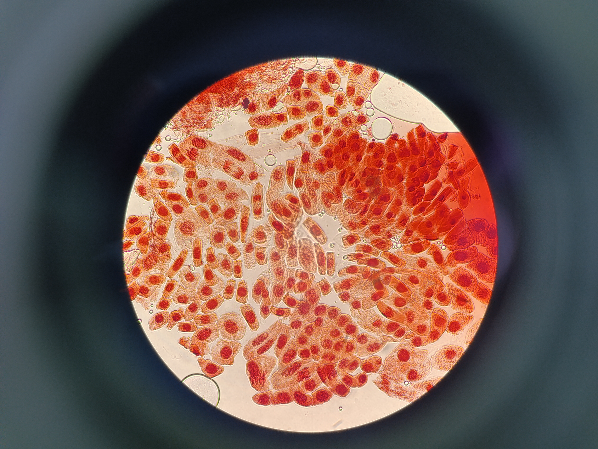

# CellZ - Automated Cell Counter

[🇺🇸 English](README.md) | **🇧🇷 Português**

> CellZ is an automated cell counting tool designed to help researchers analyze *Allium cepa* (onion) cells in microscope slide images. It uses advanced computer vision techniques to detect and count individual cell nuclei with high accuracy.

## Features
- ✅ Automated cell detection and counting using Progressive Erosion Harvesting
- ✅ Dual-channel analysis for robust nucleus identification  
- ✅ Batch processing with automatic folder structure preservation
- ✅ Support for multiple image formats (JPEG, PNG, HEIC)
- ✅ Annotated output images with numbered cells and total count
- ✅ Handles densely packed and overlapping cells

## Requirements
- Python 3.8 or higher
- Images taken from microscope eyepiece with circular viewing area

## Installation & Usage

1. **Install dependencies:**
  ```bash
  pip install -r requirements.txt
  ```
2. **Run the program:**

```bash
python main.py
```
3. **First run setup:**
- The program creates two folders: **IMAGENS** (input) and **IMAGENS ANOTADAS** (output)
- Place your microscope images in the **IMAGENS** folder
- Processed images with cell counts appear in **IMAGENS** ANOTADAS
- Already processed images are automatically skipped


## How it works
CellZ uses a novel **Progressive Erosion Harvesting** algorithm that:
1. Isolates the circular sample area from the background
2. Uses blue channel analysis to identify cellular regions
3. Uses green channel analysis to detect dark nuclei within cells
4. Iteratively separates touching nuclei using morphological operations
5. Validates detections based on size and shape criteria

## Sample Results


<table>
<tr>
<td></td>
<td></td>
</tr>
<tr>
<td align="center">Original Image</td>
<td align="center">Annotated Image</td>
</tr>
</table>

<table>
<tr>
<td></td>
<td></td>
</tr>
<tr>
<td align="center">Original Image</td>
<td align="center">Annotated Image</td>
</tr>
</table>

<table>
<tr>
<td></td>
<td></td>
</tr>
<tr>
<td align="center">Original Image</td>
<td align="center">Annotated Image</td>
</tr>
</table>


Created by [Victor Hugo Cercasin](https://github.com/VictorCercasin/SortSorter).
Project's [GitHub](https://github.com/VictorCercasin/) page