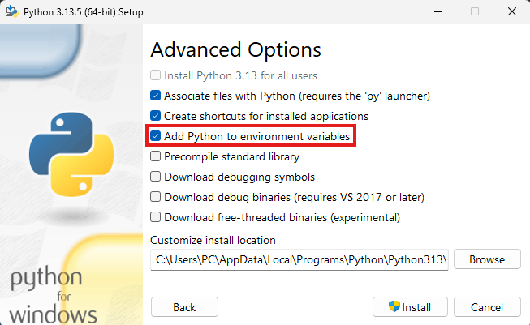
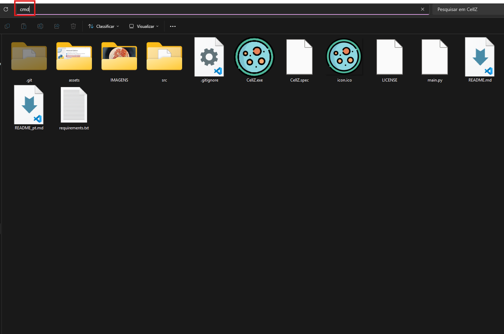
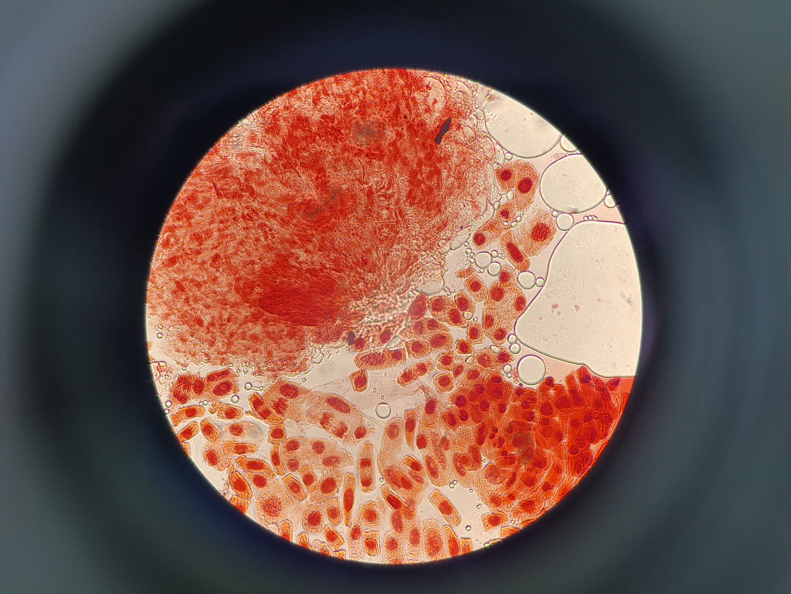

# CellZ - Contador Automático de Células

[🇺🇸 English](README_en.md) | **🇧🇷 Português**

> CellZ é uma ferramenta automatizada para contagem de células projetada para ajudar pesquisadores a analisar células de *Allium cepa* (cebola) em imagens de lâminas de microscópio. Utiliza técnicas avançadas de visão computacional para detectar e contar núcleos celulares individuais com alta precisão.

## Características
- ✅ Detecção e contagem automática de células usando Progressive Erosion Harvesting
- ✅ Análise de duplo canal para identificação robusta de núcleos
- ✅ Processamento em lote com preservação automática da estrutura de pastas
- ✅ Suporte para múltiplos formatos de imagem (JPEG, PNG, HEIC)
- ✅ Imagens de saída anotadas com células numeradas e contagem total
- ✅ Lida com células densamente agrupadas e sobrepostas

## Requisitos
- Python 3.8 ou superior
- Imagens tiradas da ocular do microscópio com área de visualização circular

## Instalação e Uso

1. Instale o Python

- Visite o link https://www.python.org/downloads/
- Faça o download da versão mais recente do python
- Execute a instalação


⚠️ IMPORTANTE: Durante a instalação, certifique-se de marcar a opção "Add Python to PATH" ou "Add Python to environment variables" para que o Python funcione no terminal.




2. Faça o download do CellZ
- No topo da página do projeto no [GitHub](https://github.com/VictorCercasin/CellZ), clique no botão "Code" e em seguida, "Download ZIP"
- Descomprima o arquivo em um diretório de sua preferência
- Se preferir, utilize o git para fazer a clonagem do projeto

3. Instale as dependências:
- Navegue até a pasta do CellZ no explorador de arquivos
- Na **barra de endereços** (onde mostra o caminho da pasta), delete o texto, digite `cmd` e pressione Enter



- No terminal que abrir, execute o comando:


```bash
pip install -r requirements.txt
```
⚠️ Em caso de erro, tente:
- `python -m pip install -r requirements.txt`
- Ou reinicie o computador
- Ou reinstale o Python

- Para executar o programa, basta digitar no terminal o comando:
```bash
python main.py
```

4. **Primeira execução e funcionamento:**
- Ao ser executado a primeira vez, o programa cria duas pastas: **IMAGENS** (entrada) e **IMAGENS ANOTADAS** (saída)
- Coloque suas imagens de microscópio na pasta **IMAGENS** e execute novamente
- Imagens processadas com contagem de células aparecem no diretório **IMAGENS ANOTADAS** 
- Imagens já processadas são automaticamente ignoradas

5. **Limpeza de anomalias:**
- Em alguns casos, certas regiões das imagens podem conter anomalias que dificultam a contagem das células:

<table>
<tr>
<td></td>
<td></td>
</tr>
<tr>
<td align="center">Imagem Original</td>
<td align="center">Imagem Anotada</td>
</tr>
</table>

Nesses casos é aconselhado que a região anômala seja pintada de preto antes da contagem:

<table>
<tr>
<td></td>
<td></td>
</tr>
<tr>
<td align="center">Imagem com anomalias pintadas</td>
<td align="center">Imagem Anotada</td>
</tr>
</table>


## Como Funciona
CellZ utiliza um algoritmo inovador de **Progressive Erosion Harvesting** que:
1. Isola a área circular da amostra do fundo
2. Usa análise do canal azul para identificar regiões celulares
3. Usa análise do canal verde para detectar núcleos escuros dentro das células
4. Separa iterativamente núcleos em contato usando operações morfológicas
5. Valida detecções baseado em critérios de tamanho e forma

## Resultados de Exemplo


<table>
<tr>
<td></td>
<td></td>
</tr>
<tr>
<td align="center">Imagem Original</td>
<td align="center">Imagem Anotada</td>
</tr>
</table>

<table>
<tr>
<td></td>
<td></td>
</tr>
<tr>
<td align="center">Imagem Original</td>
<td align="center">Imagem Anotada</td>
</tr>
</table>

<table>
<tr>
<td></td>
<td></td>
</tr>
<tr>
<td align="center">Imagem Original</td>
<td align="center">Imagem Anotada</td>
</tr>
</table>


Criado por [Victor Hugo Cercasin](https://github.com/VictorCercasin/).
Repositório do Projeto [GitHub](https://github.com/VictorCercasin/CellZ).
